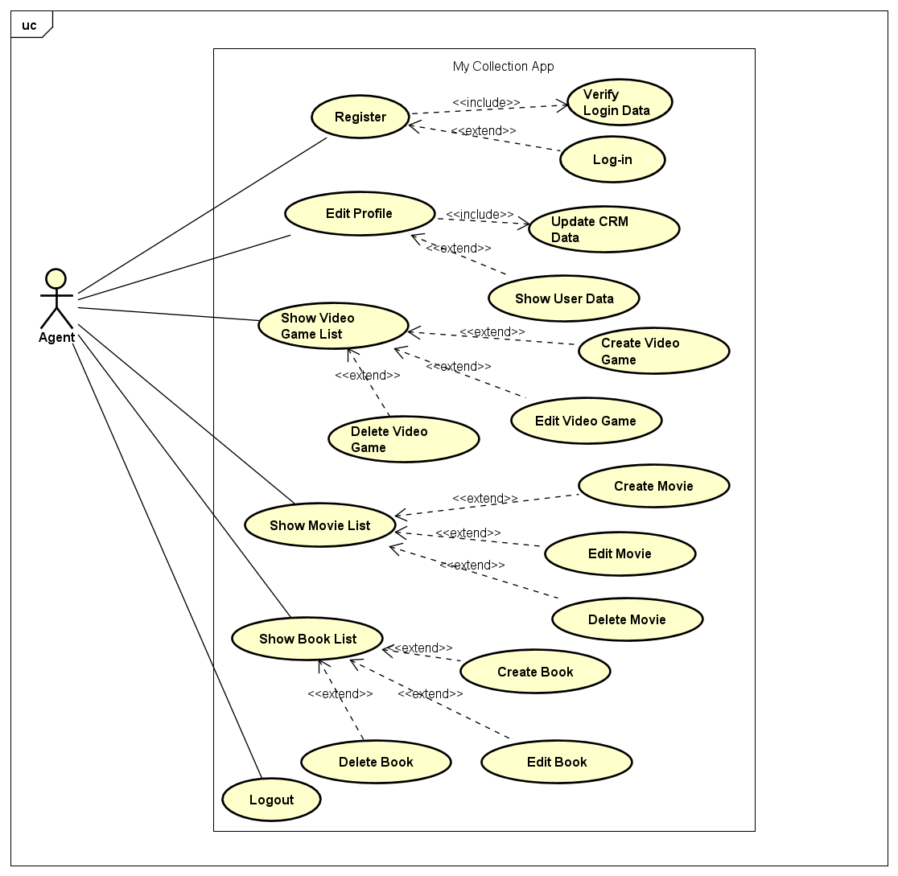
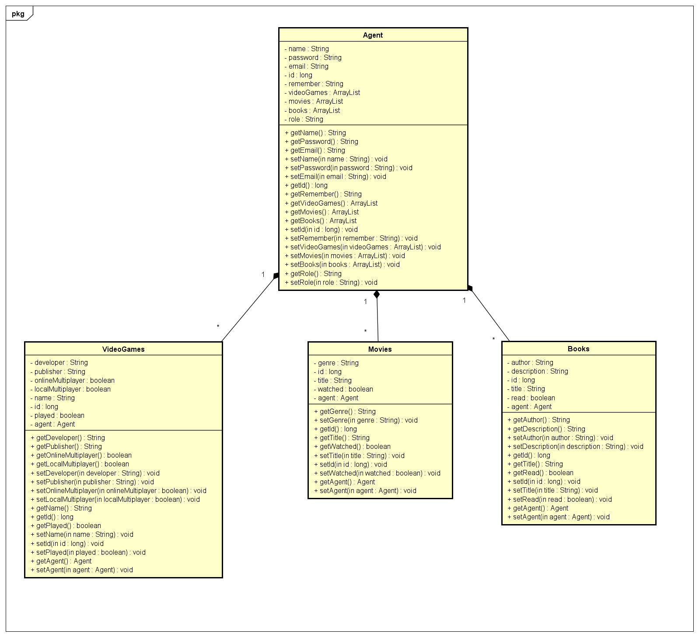

# My Collection App

This website is published at mycollectionapp.herokuapp.com/login.
(Initial website without the backend development bestbooks.ezknowapp.com)

## Initial Use Cases

> Buyer
```
As a {User}, I want to have several filter options to search after the needed book. 
As a {User}, I want to have an email from the seller so that I can contact the seller. 
As a {User}, I want to see the most important key data of the book so that I can decide whether it is the right book or not.
```

>Seller
```
As a {User}, I want to log-in to the website in order to create a listing of a used book. 
As a {User}, I want to see the current and past listings.
```

>Account Administration
```
As a {User}, I want to create an account so that I can access the website. 
As a {User}, I want to be able to update the email_address of my account. 
As a {User}, I want to be able to update the phone_number of my account. 
As a {User}, I want to be able to the update the password of my account 
As a {User}, I want to be able to reset the password of my account in case my account was hacked or I forgot my password.
```

## Customized Use Cases

```
Login and Registration Use-Cases:

As a {User}, I want to register with my name, email address and a password so that I can create an account and enter the website.
As a {User}, I want to login with my email address and a password so I can enter the website.


Profile Use-Cases:

As a {User}, I want to edit my profile so I can keep my account uptodated.
As a {User}, I want to change my name to keep my account uptodated.
As a {User}, I want to change my email address to keep my account uptodated.
As a {User}, I want to change my password to keep my account uptodated.


Log-out Use-Case:

As a {User}, I want to be able to log-out so I can prevent third-party to make changes while my device is not locked.


Video Games Collection Use-Cases:

As a {User}, I want to be able to fill in the title of the video game so I can distinguish the title from other entries.
As a {User}, I want to be able to fill in the developer of the video game so I can have more information about the video game.
As a {User}, I want to be able to fill in the publisher of the video game so I can have more information about the video game.
As a {User}, I want to be able to fill in a yes or no value to online multiplayer so I can have more information about the video game.
As a {User}, I want to be able to fill in a yes or no value to local multiplayer so I can have more information about the video game.
As a {User}, I want to be able to fill in the status of my video game entry so that I can retrieve the completeness of the video game entry.


Movies Collection Use-Cases:

As a {User}, I want to be able to fill in the title of the movies so I can distinguish the title from other entries.
As a {User}, I want to be able to fill in the Genre of the movie so I can have more information about the movie.
As a {User}, I want to be able to fill in the status of my movie entry so that I can retrieve the completeness of the movie entry.


Books Collection Use-Cases:

As a {User}, I want to be able to fill in the title of the books so I can distinguish the title from other entries.
As a {User}, I want to be able to fill in the author of the book so I can have more information about the book.
As a {User}, I want to be able to fill in a description of the book so I can have more information about the book.
As a {User}, I want to be able to fill in the status of my book entry so that I can retrieve the completeness of the book entry.


General Collection Use-Cases:

As a {User}, I want to add an entry to each collection so I can list them at one place.
As a {User}, I want to be able to edit all the information for each collection to keep them uptodated.
As a {User}, I want to be able to delete my entry to keep each collection uptodated.
As a {User}, I want to be able to save the entry for each collection with the according information to have them listed.
As a {User}, I wanto to have an unique ID-Number for every entry for each collection so that I can distinguish each entry.
```


### Domain Design

The `ch.fhnw.acrm.data.domain` package contains the following domain objects / entities including getters and setters:



### Business Logic Design

The `ch.fhnw.acrm.business.service` package contains classes of the following business services:


## Mission / Initial Goal

The initial goal of the website was to create and build an ecommerce platform that mainly focuses on the buying and selling of used books related to school and/or university in the perspective of potential buyers and sellers. It should be a website where a potential buyer can use the simple interface of the website to browse the listings of books. A seller on the other hand should have the possibility to register and login to upload their books. The payment will happen outside of the website. The website will just work as a general marketplace with the mission to connect buyer and seller and is not liable.

## Problem Statement

Because of the ambitious goal to build an ecommerce website, the development team severely undererstimated the back-end development as well as the seemless integration of the front-end part of the website. In order to successfully deploy the website project as well as maintaining the given deadline, the team decided to cut features of the website and focus on the essential part of the website with the ambition to add the features later on.

## Further Notes

In the code the class customer was not used. However, for the sake of simplicity, it was not deleted.

## Result

Instead of an ecommerce platform with users such as buyers and sellers the team build a website where users can create an account to enter the website and create a collection of their video games, movies and books. Furthermore, users can adjust each collection with the according delete, edit and add buttons. The website serves purely to manage the mentioned collection. With basic use-cases it is possible to expand the website to an ecommerce platform website in the future.

## Resources

Materials from the Internet Technology Course
Bootstrap
Visual Studio Code
Intelij IDEA IDE
Spring Boot Framework

## Author

Bächli Adina - adina.baechli@students.fhnw.ch: Front-End Developer

Buga Kiril - kiril.buga@students.fhnw.ch: Back-End Developer and Front-End Developer

Hoenen Leandro - leandro.hoenen@students.fhnw.ch: Back-End Developer and Front-End Developer

Zaccariello Nicolai - nicolai.zaccariello@students.fhnw.ch: Front-End Developer


## License
Copyright 2022. All rights reserved.
